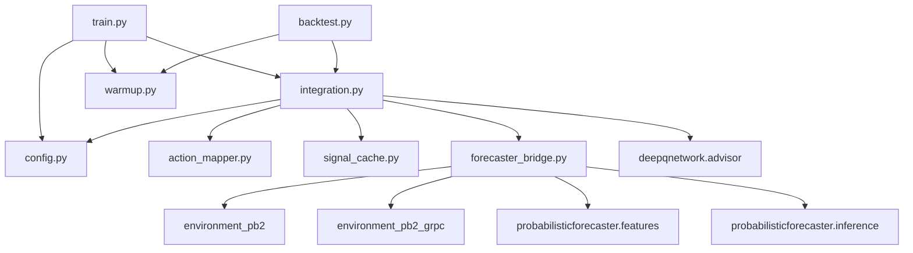

# Design Document: Intraday Trading Agent (DQN + ProbabilisticForecaster)

## Overview

This document describes the technical design for an intraday trading agent that combines a Deep Q-Network (DQN) for action selection with a Transformer-based ProbabilisticForecaster for risk screening. The new work is an integration layer that wires both models together via the existing modelenv gRPC service.

The integration layer sits between the DQN output and the modelenv `Step()` call. It screens DQN actions using the forecaster's return distribution estimates (mu, sigma), applies risk budget constraints that only count positions opened during high-uncertainty regimes (sigma > variance_threshold), and submits the screened action to modelenv. Both parent models are unchanged; the DQN receives the standard 53-feature observation state, and the forecaster receives 5-min OHLC bars via modelenv's `RecentBars` RPC.

**Key Design Decisions:**

- **Single-symbol per instance**: Risk budget counters are stateful; each `IntegrationLayer` instance is bound to one symbol for its lifetime. Multi-symbol setups use separate instances.
- **Explicit action-to-unit mapping**: DQN action indices (0–4) are never used directly as unit counts. A static lookup table maps each index to `(direction, risk_units)`.
- **Signal caching**: The forecaster's (mu, sigma) is only recomputed when a new completed M5 bar arrives. At 60s step size, ~80% of timesteps use the cached signal.
- **Budget only counts high-sigma positions**: Positions opened when sigma <= variance_threshold do not consume the risk budget. The forecaster gates exposure via the budget, not via blanket suppression.

## Architecture

### System Context

```mermaid
graph LR
    subgraph "Existing (unchanged)"
        ME[modelenv<br/>Rust gRPC]
        DQN[DQNAdvisor<br/>stateless]
        FC[ForecasterInference<br/>stateless]
        FE[compute_features<br/>stateless function]
    end

    subgraph "New"
        IL[IntegrationLayer<br/>screening + budgets]
        TR[train.py<br/>combined training entry point]
    end

    ME -->|Reset/Step<br/>53-feature state| IL
    ME -->|RecentBars<br/>M5 bars| IL
    IL -->|state vector| DQN
    DQN -->|ActionResult| IL
    IL -->|M5 DataFrame| FE
    FE -->|(36,16) tensor| IL
    IL -->|(36,16) tensor| FC
    FC -->|(mu, sigma)| IL
    IL -->|screened action| ME
    TR --> IL
```

### Project Structure

```
tradingmodel/intraday/dqnpf/
├── __init__.py              # Package exports
├── integration.py           # IntegrationLayer, IntegrationConfig, ScreenedAction
├── action_mapper.py         # Action → (direction, risk_units) lookup
├── signal_cache.py          # Forecaster signal cache with M5 bar timestamp key
├── forecaster_bridge.py     # RecentBars → compute_features → predict pipeline
├── warmup.py                # Cold-start bar loading and feature pre-computation
├── train.py                 # Combined training entry point
├── backtest.py              # Combined vs DQN-only evaluation
├── config.py                # YAML + CLI configuration loading
├── config.yaml              # Default configuration values
└── requirements.txt         # Pinned Python dependencies
```

### Module Dependency Graph



## Components and Interfaces

### 1. Configuration (`config.py`)

```python
@dataclass
class IntegrationConfig:
    """Configuration for the integration layer.

    Attributes:
        symbol: Currency pair (e.g. "USDJPY"). Bound at construction.
        variance_threshold: Sigma value (bps) above which opened positions
            consume the risk budget. Default 4.5.
        max_risk_long_units: Hard cap on cumulative long exposure opened
            during high-sigma regimes. Default 2.
        max_risk_short_units: Hard cap on cumulative short exposure opened
            during high-sigma regimes. Default 1.
        directional_disagreement: Whether sign conflict with forecaster
            suppresses the DQN action. Default False.
        directional_tolerance: abs(mu) below which directional check is
            skipped, in bps. Default 1.0.
        forecast_horizon: Forecaster horizon in 5-min bars. Default 1.
        min_bars_warmup: M5 bars required before forecaster is valid.
            Default 1440.
        step_size_seconds: Decision interval. Default 60.
        dqn_checkpoint_path: Path to DQN checkpoint (trained at 60s).
        forecaster_checkpoint_path: Path to forecaster checkpoint.
    """
    symbol: str
    variance_threshold: float = 4.5
    max_risk_long_units: int = 2
    max_risk_short_units: int = 1
    directional_disagreement: bool = False
    directional_tolerance: float = 1.0
    forecast_horizon: int = 1
    min_bars_warmup: int = 1440
    step_size_seconds: int = 60
    dqn_checkpoint_path: str | None = None
    forecaster_checkpoint_path: str | None = None

    def __post_init__(self) -> None:
        """Validate field constraints."""
        if self.variance_threshold < 0:
            raise ValueError("variance_threshold must be non-negative")
        if self.max_risk_long_units < 0 or self.max_risk_short_units < 0:
            raise ValueError("risk budget caps must be non-negative")
        if self.directional_tolerance < 0:
            raise ValueError("directional_tolerance must be non-negative")
        if self.forecast_horizon not in {1, 3, 6, 12}:
            raise ValueError("forecast_horizon must be one of {1, 3, 6, 12}")
```

### 2. Action Mapper (`action_mapper.py`)

Explicit static mapping from DQN action indices to `(direction, risk_units)`. The raw index is never used as a unit count.

```python
from enum import Enum

class Direction(Enum):
    NONE = "none"
    LONG = "long"
    SHORT = "short"

@dataclass(frozen=True)
class ActionUnit:
    direction: Direction
    risk_units: int

# Static lookup table
ACTION_MAP: dict[int, ActionUnit] = {
    0: ActionUnit(Direction.NONE,  0),   # HOLD
    1: ActionUnit(Direction.LONG,  1),   # BUY_1
    2: ActionUnit(Direction.LONG,  2),   # BUY_2
    3: ActionUnit(Direction.SHORT, 1),   # SELL_1
    4: ActionUnit(Direction.SHORT, 2),   # SELL_2
}

def map_action(action_index: int) -> ActionUnit:
    """Map a DQN action index to its direction and risk units.

    Raises:
        ValueError: If action_index is not in [0, 4].
    """
    if action_index not in ACTION_MAP:
        raise ValueError(f"Invalid action index: {action_index}")
    return ACTION_MAP[action_index]
```

### 3. Forecaster Bridge (`forecaster_bridge.py`)

Encapsulates the pipeline from modelenv `RecentBars` → `compute_features` → `ForecasterInference.predict`.

```python
class ForecasterBridge:
    """Pipeline: RecentBars M5 bars → features → (mu, sigma).

    Args:
        forecaster: Loaded ForecasterInference instance.
        symbol: Currency pair, used in RecentBars request.
        env_client: modelenv gRPC client.
    """

    def __init__(
        self,
        forecaster: ForecasterInference,
        symbol: str,
        env_client: EnvironmentClient,
    ): ...

    def compute_signal(self) -> tuple[float, float]:
        """Call RecentBars, extract M5 bars, compute features, predict.

        Returns:
            (mu, sigma) as Python floats.

        Raises:
            KeyError: If "M5" key is missing from RecentBarsResponse.
            ValueError: If M5 bar series has fewer than 36 bars.
        """
        ...

    def compute_signal_from_bars(self, bars_df: pd.DataFrame) -> tuple[float, float]:
        """Compute (mu, sigma) from a pre-loaded M5 bar DataFrame.

        Used during warm-up and testing to avoid gRPC calls.
        """
        ...
```

**Internal flow:**
1. `env_client.recent_bars(symbol)` → `RecentBarsResponse` (gRPC)
2. `response.bars["M5"]` → `BarList` → convert to DataFrame with columns `[Timestamp, Open, High, Low, Close, Volume]`
3. `compute_features(bars_df)` → `(N, 16)` DataFrame
4. Select last 36 rows → `(36, 16)` float32 tensor
5. `forecaster.predict(tensor)` → `(mu, sigma)`

### 4. Signal Cache (`signal_cache.py`)

Caches the forecaster's (mu, sigma) until a new completed M5 bar arrives.

```python
@dataclass
class CachedSignal:
    mu: float
    sigma: float
    bar_timestamp: int  # unix nanoseconds of the latest completed M5 bar

class SignalCache:
    """Caches forecaster predictions keyed by latest M5 bar timestamp.

    At 60s step size, 4 out of 5 timesteps reuse the cached signal.
    """

    def __init__(self) -> None:
        self._cache: CachedSignal | None = None

    def get_or_compute(
        self,
        latest_bar_ts: int,
        compute_fn: Callable[[], tuple[float, float]],
    ) -> tuple[float, float]:
        """Return cached (mu, sigma) if bar timestamp matches, else recompute.

        Args:
            latest_bar_ts: Timestamp of the latest completed M5 bar, in
                unix nanoseconds.
            compute_fn: Zero-argument callable that produces (mu, sigma).

        Returns:
            (mu, sigma) tuple.
        """
        if self._cache is not None and self._cache.bar_timestamp == latest_bar_ts:
            return self._cache.mu, self._cache.sigma

        mu, sigma = compute_fn()
        self._cache = CachedSignal(mu=mu, sigma=sigma, bar_timestamp=latest_bar_ts)
        return mu, sigma

    def invalidate(self) -> None:
        """Clear the cache. Called on Reset()."""
        self._cache = None
```

### 5. Integration Layer (`integration.py`)

The primary component. Screens DQN actions using forecaster signals and risk budgets.

```python
@dataclass
class ScreenedAction:
    """Result of screening a DQN action.

    Attributes:
        action: Final action index (0-4), potentially overridden.
        action_name: Human-readable action name.
        screened: True if the action was modified by a risk rule.
        reason: One of "pass", "budget_exhausted", "directional_conflict".
        sigma: Sigma value at decision time, for downstream logging.
        risk_long_used: Cumulative long budget units after this action.
        risk_short_used: Cumulative short budget units after this action.
    """
    action: int
    action_name: str
    screened: bool
    reason: str
    sigma: float
    risk_long_used: int
    risk_short_used: int

class IntegrationLayer:
    """Screens DQN actions using forecaster signals and risk budgets.

    Bound to a single symbol. Tracks cumulative risk budget counters
    that only increment when positions are opened during high-sigma
    regimes (sigma > variance_threshold).

    Args:
        dqn: Loaded DQNAdvisor instance.
        forecaster_bridge: ForecasterBridge for signal computation.
        signal_cache: SignalCache for caching forecaster predictions.
        config: IntegrationConfig with thresholds and budget caps.
    """

    def __init__(
        self,
        dqn: DQNAdvisor,
        forecaster_bridge: ForecasterBridge,
        signal_cache: SignalCache,
        config: IntegrationConfig,
    ) -> None:
        self._dqn = dqn
        self._bridge = forecaster_bridge
        self._cache = signal_cache
        self._config = config
        self._risk_long_units: int = 0
        self._risk_short_units: int = 0

    def screen(
        self, dqn_action: ActionResult, mu: float, sigma: float
    ) -> ScreenedAction: ...

    def on_position_closed(self, side: str, units: int) -> None: ...

    @property
    def risk_long_used(self) -> int: ...
    @property
    def risk_short_used(self) -> int: ...
```

**`screen()` implementation logic:**

```python
ACTION_NAMES = ["HOLD", "BUY_1", "BUY_2", "SELL_1", "SELL_2"]

def screen(self, dqn_action: ActionResult, mu: float, sigma: float) -> ScreenedAction:
    unit = map_action(dqn_action.action)

    # Rule 1: Risk budget (high-sigma only)
    if sigma > self._config.variance_threshold:
        if unit.direction == Direction.LONG:
            if self._risk_long_units + unit.risk_units > self._config.max_risk_long_units:
                return self._hold("budget_exhausted", sigma)
        elif unit.direction == Direction.SHORT:
            if self._risk_short_units + unit.risk_units > self._config.max_risk_short_units:
                return self._hold("budget_exhausted", sigma)

    # Rule 2: Directional conflict
    if self._config.directional_disagreement:
        if abs(mu) > self._config.directional_tolerance:
            mu_direction = Direction.LONG if mu > 0 else Direction.SHORT
            if mu_direction != unit.direction and unit.direction != Direction.NONE:
                return self._hold("directional_conflict", sigma)

    # Rule 3: Pass-through
    if sigma > self._config.variance_threshold:
        if unit.direction == Direction.LONG:
            self._risk_long_units += unit.risk_units
        elif unit.direction == Direction.SHORT:
            self._risk_short_units += unit.risk_units

    return ScreenedAction(
        action=dqn_action.action,
        action_name=dqn_action.action_name,
        screened=False,
        reason="pass",
        sigma=sigma,
        risk_long_used=self._risk_long_units,
        risk_short_used=self._risk_short_units,
    )

def _hold(self, reason: str, sigma: float) -> ScreenedAction:
    return ScreenedAction(
        action=0,
        action_name="HOLD",
        screened=True,
        reason=reason,
        sigma=sigma,
        risk_long_used=self._risk_long_units,
        risk_short_used=self._risk_short_units,
    )

def on_position_closed(self, side: str, units: int) -> None:
    if side == "buy":
        self._risk_long_units = max(0, self._risk_long_units - units)
    elif side == "sell":
        self._risk_short_units = max(0, self._risk_short_units - units)
```

### 6. Warm-Up Manager (`warmup.py`)

Handles cold-start: loads historical M5 bars and pre-computes features so the forecaster is valid from the first timestep.

```python
class WarmUpManager:
    """Load historical M5 bars and pre-compute features for forecaster warm-up.

    Args:
        env_client: modelenv gRPC client.
        symbol: Currency pair.
        min_bars: Minimum bars required (default 1440).
    """

    def __init__(
        self,
        env_client: EnvironmentClient,
        symbol: str,
        min_bars: int = 1440,
    ): ...

    def warm_up(self) -> pd.DataFrame:
        """Load historical M5 bars and compute features.

        Uses the same data source modelenv loaded at Reset() time.

        Returns:
            DataFrame with 16 feature columns, indexed by timestamp.
            The caller uses the last 36 rows for the first forecaster
            prediction.

        Raises:
            RuntimeError: If fewer than min_bars are available.
        """
        ...
```

**Warm-up strategy:**
1. After `Reset()`, modelenv has loaded parquet data into its in-memory cache.
2. `RecentBars(symbol)` returns all completed bars from the start of the data range.
3. Extract M5 bars, verify count >= `min_bars`.
4. Run `compute_features()` on the full series.
5. Cache the feature DataFrame for the first forecaster prediction.
6. Subsequent timesteps call `RecentBars` and `compute_features` incrementally.

### 7. Training Entry Point (`train.py`)

Orchestrates the combined training loop.

```python
def main() -> None:
    """Combined training entry point.

    1. Load config from YAML + CLI overrides.
    2. Initialise modelenv gRPC client.
    3. Load DQNAdvisor and ForecasterInference from checkpoints.
    4. Build IntegrationLayer.
    5. Run warm-up.
    6. For each episode:
       a. Reset(symbol, start_ts, end_ts, step_size_seconds=60)
       b. While not done:
          - Get state from current Observation → DQNAdvisor.recommend_action()
          - Get M5 bars from RecentBars → cache → ForecasterBridge
          - screen(dqn_result, mu, sigma) → ScreenedAction
          - Step(screened_action.action)
          - Log metrics
    7. Save episode metrics for backtest comparison.
    """
    config = load_config()
    device = resolve_device(config.get("device", "cpu"))

    env_client = EnvironmentClient(config.grpc_address)

    dqn = DQNAdvisor.from_checkpoint(
        config.dqn_checkpoint_path, device=device
    )
    forecaster = ForecasterInference(
        config.forecaster_checkpoint_path,
        ForecasterConfig(forecast_horizon=config.forecast_horizon),
    )

    bridge = ForecasterBridge(forecaster, config.symbol, env_client)
    cache = SignalCache()
    integration = IntegrationLayer(dqn, bridge, cache, config)

    warmup_mgr = WarmUpManager(env_client, config.symbol, config.min_bars_warmup)
    features_df = warmup_mgr.warm_up()

    for episode in range(config.num_episodes):
        obs = env_client.reset(
            symbol=config.symbol,
            episode_start_ts=config.episode_start_ts,
            episode_end_ts=config.episode_end_ts,
            step_size_seconds=config.step_size_seconds,
        )
        cache.invalidate()

        while not obs.done:
            state = preprocessor.process(obs)
            dqn_result = dqn.recommend_action(state)

            # Get forecaster signal (cached if bar hasn't changed)
            response = env_client.recent_bars(config.symbol)
            m5_bars = _extract_m5_bars(response)
            latest_ts = m5_bars["Timestamp"].max()

            def compute():
                features = compute_features(m5_bars)
                tensor = _features_to_tensor(features)
                return forecaster.predict(tensor)

            mu, sigma = cache.get_or_compute(latest_ts, compute)

            screened = integration.screen(dqn_result, mu, sigma)
            obs = env_client.step(screened.action, generate_order_id())
            # ... log step metrics ...

        # ... log episode metrics ...
```

### 8. Backtest Entry Point (`backtest.py`)

Evaluates the combined system against the DQN-only baseline on identical episodes.

```python
@dataclass
class BacktestComparison:
    combined_return: float
    baseline_return: float
    combined_sharpe: float
    baseline_sharpe: float
    suppression_rate: float               # fraction of actions screened
    suppression_by_reason: dict[str, int]  # {"budget_exhausted": N, "directional_conflict": M}
    high_sigma_pnl_combined: float         # combined PnL during sigma > threshold
    high_sigma_pnl_baseline: float         # baseline PnL during sigma > threshold
    low_sigma_pnl_combined: float
    low_sigma_pnl_baseline: float
    trades_combined: int
    trades_baseline: int
    quarterly_pnl: dict[str, float]        # PnL by calendar quarter

def run_backtest(config: IntegrationConfig) -> BacktestComparison:
    """Run combined system and DQN-only baseline on identical episodes.

    The baseline runs the same episodes with the same seed but without
    the integration layer, DQN actions go directly to Step().
    """
    ...
```

## Data Models

### Action-to-Unit Mapping

| ActionType | Index | Direction | Risk Units |
|------------|-------|-----------|-------------|
| HOLD       | 0     | NONE      | 0           |
| BUY_1      | 1     | LONG      | 1           |
| BUY_2      | 2     | LONG      | 2           |
| SELL_1     | 3     | SHORT     | 1           |
| SELL_2     | 4     | SHORT     | 2           |

### ScreenedAction

```python
ScreenedAction(
    action: int,            # 0–4
    action_name: str,       # "HOLD", "BUY_1", etc.
    screened: bool,         # True if modified
    reason: str,            # "pass" | "budget_exhausted" | "directional_conflict"
    sigma: float,           # sigma at decision time (bps)
    risk_long_used: int,    # cumulative long budget consumption
    risk_short_used: int,   # cumulative short budget consumption
)
```

### RecentBarsResponse → M5 DataFrame

```python
# gRPC response: map<string, BarList>
response.bars["M5"]  # BarList with repeated Bar messages

# Converted to DataFrame:
#   Timestamp (datetime64[ns]), Open, High, Low, Close, Volume (all float64)
```

### Forecaster Input Tensor

```python
# Shape: (36, 16)
# Columns: z_high, z_low, z_close, z_hl_spread, z_ema5, z_ema20, z_ema30,
#           z_ema60, ret_high, ret_low, ret_close, vol_high, vol_low,
#           vol_close, time_sin, time_cos
```

### Checkpoint Format

```python
{
    "dqn_checkpoint_path": str,           # path to DQN .pt file
    "forecaster_checkpoint_path": str,     # path to forecaster .pt file
    "integration_config": dict,            # serialised IntegrationConfig
    "metadata": {
        "symbol": "USDJPY",
        "trained_at": "2026-05-15T10:30:00Z",
        "step_size_seconds": 60,
    }
}
```

## Correctness Properties

### Property 1: Screened action validity

*For any* valid DQN ActionResult and any finite (mu, sigma) where sigma > 0, the `screen()` method SHALL return a ScreenedAction whose `action` is in [0, 4] and `reason` is one of {"pass", "budget_exhausted", "directional_conflict"}.

**Validates: Requirements 1.1, 1.2, 1.3**

### Property 2: Action-to-unit mapping correctness

*For any* valid action index in [0, 4], `map_action(index)` SHALL return the correct `(Direction, risk_units)` pair as defined in the mapping table. *For any* index outside [0, 4], `map_action` SHALL raise ValueError.

**Validates: Requirements 2.1–2.6**

### Property 3: Low-sigma pass-through

*For any* valid DQN action and any (mu, sigma) where sigma <= variance_threshold and directional_disagreement is disabled, `screen()` SHALL return the input action unchanged with reason "pass" and SHALL NOT increment either budget counter.

**Validates: Requirements 3.5, 3.6**

### Property 4: High-sigma budget consumption

*For any* valid BUY_1/BUY_2/SELL_1/SELL_2 action when sigma > variance_threshold and the corresponding budget is NOT exhausted, `screen()` SHALL pass the action through, increment the corresponding budget counter by the action's risk_units, and NOT increment the opposite-side counter.

**Validates: Requirements 3.4**

### Property 5: Budget exhaustion

*For any* valid BUY_1/BUY_2 action when sigma > variance_threshold and `risk_long_units + action_risk_units > max_risk_long_units`, `screen()` SHALL return HOLD with reason "budget_exhausted". Symmetric for short side.

**Validates: Requirements 3.2, 3.3**

### Property 6: Budget never exceeded

*For any* sequence of `screen()` calls, `risk_long_units` SHALL never exceed `max_risk_long_units` and `risk_short_units` SHALL never exceed `max_risk_short_units`.

**Validates: Requirements 3.2, 3.3**

### Property 7: Budget release

*For any* integration layer state and any call to `on_position_closed(side, n)`, the corresponding budget counter SHALL decrease by n (clamped to zero). After release, a previously blocked action that now fits within budget SHALL pass through.

**Validates: Requirement 3.7**

### Property 8: Directional conflict rule

*Where* directional_disagreement is enabled, *for any* action where `abs(mu) > directional_tolerance` and `sign(mu) != direction_of(action)`, `screen()` SHALL return HOLD with reason "directional_conflict". *Where* directional_disagreement is disabled, the rule SHALL be skipped regardless of mu and action.

**Validates: Requirements 4.2, 4.3, 4.4**

### Property 9: Rule priority order

*For any* input where both the budget rule and directional conflict rule would trigger, the budget rule SHALL take precedence (reason "budget_exhausted", not "directional_conflict").

**Validates: Requirement 1.2**

### Property 10: Signal cache hit

*For any* sequence of `get_or_compute` calls where `latest_bar_ts` is unchanged, the `compute_fn` SHALL be called at most once and subsequent calls SHALL return the same (mu, sigma) values.

**Validates: Requirements 7.2, 7.3**

### Property 11: Signal cache miss

*For any* call to `get_or_compute` where `latest_bar_ts` differs from the cached timestamp, `compute_fn` SHALL be invoked and the cache SHALL be updated.

**Validates: Requirement 7.3**

### Property 12: Config validation

*For any* IntegrationConfig construction, invalid field values (negative thresholds, invalid forecast_horizon) SHALL raise ValueError. Valid values SHALL construct successfully.

**Validates: Requirements 5.3, 5.4, 11.2**

### Property 13: Single-symbol isolation

*For any* two IntegrationLayer instances with different symbols and different configs, operations on one SHALL NOT affect the budget counters or screening results of the other.

**Validates: Requirements 10.6, 10.8**

### Property 14: Warm-up bar count

*For any* call to `WarmUpManager.warm_up()` where >= min_bars are available, the method SHALL return a DataFrame with at least min_bars rows and 16 columns. *For any* call where < min_bars are available, the method SHALL raise RuntimeError.

**Validates: Requirements 8.1, 8.3**

## Error Handling

### Configuration Errors

| Scenario | Behaviour |
|----------|-----------|
| variance_threshold < 0 | Raise ValueError at construction |
| max_risk_long_units < 0 | Raise ValueError at construction |
| max_risk_short_units < 0 | Raise ValueError at construction |
| directional_tolerance < 0 | Raise ValueError at construction |
| forecast_horizon not in {1, 3, 6, 12} | Raise ValueError at construction |
| Missing checkpoint path in live mode | Raise ValueError |

### gRPC / modelenv Errors

| Scenario | Behaviour |
|----------|-----------|
| RecentBars returns no "M5" key | Raise KeyError with available keys |
| M5 bar series has < 36 bars | Raise ValueError with bar count |
| RecentBars gRPC failure | Propagate from EnvironmentClient (retry with backoff) |
| Step gRPC failure | Propagate from EnvironmentClient |

### Forecaster Errors

| Scenario | Behaviour |
|----------|-----------|
| Feature dimension != 16 | Raise ValueError (caught from compute_features) |
| ForecasterInference model file missing | Raise FileNotFoundError at construction |
| Invalid action index (>4 or <0) | Raise ValueError in map_action |

### Warm-Up Errors

| Scenario | Behaviour |
|----------|-----------|
| Fewer than min_bars available | Raise RuntimeError with available count |
| compute_features fails on warm-up data | Propagate error with context |

### Budget State Errors

| Scenario | Behaviour |
|----------|-----------|
| on_position_closed with unknown side | Log warning, no-op |
| on_position_closed with units > current budget | Clamp to zero (defensive) |

## Testing Strategy

### Property-Based Tests (Hypothesis)

Minimum 100 examples per property test.

| Property | Module Under Test | Tag |
|----------|------------------|-----|
| 1: Screened action validity | integration.py | Feature: dqnpf, Property 1 |
| 2: Action-to-unit mapping | action_mapper.py | Feature: dqnpf, Property 2 |
| 3: Low-sigma pass-through | integration.py | Feature: dqnpf, Property 3 |
| 4: High-sigma budget consumption | integration.py | Feature: dqnpf, Property 4 |
| 5: Budget exhaustion | integration.py | Feature: dqnpf, Property 5 |
| 6: Budget never exceeded | integration.py | Feature: dqnpf, Property 6 |
| 7: Budget release | integration.py | Feature: dqnpf, Property 7 |
| 8: Directional conflict | integration.py | Feature: dqnpf, Property 8 |
| 9: Rule priority | integration.py | Feature: dqnpf, Property 9 |
| 10: Signal cache hit | signal_cache.py | Feature: dqnpf, Property 10 |
| 11: Signal cache miss | signal_cache.py | Feature: dqnpf, Property 11 |
| 12: Config validation | config.py | Feature: dqnpf, Property 12 |
| 13: Single-symbol isolation | integration.py | Feature: dqnpf, Property 13 |
| 14: Warm-up bar count | warmup.py | Feature: dqnpf, Property 14 |

### Unit Tests (pytest)

| Test Area | Coverage |
|-----------|----------|
| ActionMapper: all 5 indices, invalid index | Req 2 |
| IntegrationConfig: default values, validation, YAML round-trip | Req 5, 11 |
| ScreenedAction: dataclass fields, immutability | Req 1 |
| IntegrationLayer: budget increment/decrement, HOLD bypass | Req 3 |
| SignalCache: empty cache, hit, miss, invalidate | Req 7 |
| ForecasterBridge: RecentBars → features → predict pipeline with mock gRPC | Req 6 |
| WarmUpManager: sufficient bars, insufficient bars | Req 8 |
| Directional conflict: enabled/disabled, tolerance boundary | Req 4 |

### Integration Tests (with mock modelenv gRPC server)

| Test Case | Coverage |
|-----------|----------|
| End-to-end: Reset → state → DQN + RecentBars → forecaster → screen → Step | Req 10 |
| Warm-up: forecaster ready after 1440+ bars loaded | Req 8 |
| Insufficient history: error raised when < 1440 bars | Req 8 |
| Signal cache: 4 of 5 steps at 60s use cached (mu, sigma) | Req 7 |
| Budget exhaustion over multi-step episode | Req 3 |
| DQN-only baseline comparison on identical episodes | Req 13 |
| Multi-instance isolation: two symbols, independent budgets | Req 10 |

### Test Dependencies

```
pytest>=7.4.0
hypothesis>=6.100.0
pytest-cov>=4.1.0
grpcio-testing>=1.56.0
moto>=4.2.0
```
